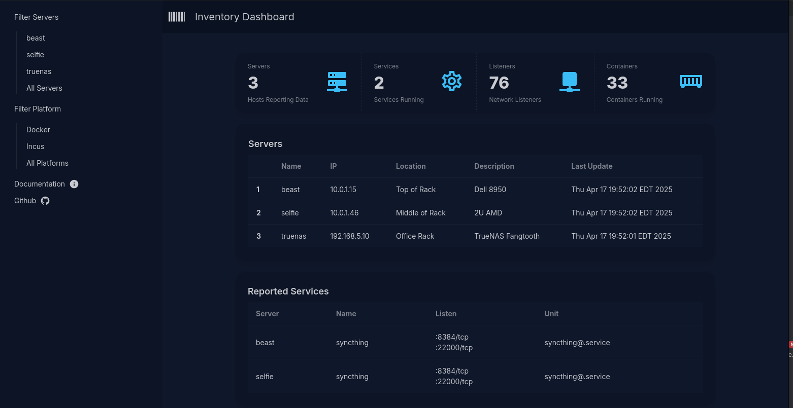

# Inventory

Inventory is an application that tracks deployed services/containers. It was built with a homelab in mind. It aims to answer the question:

| "Where the heck did I deploy Jellyfin, and was it Docker or Incus?"



## How it Works

Inventory runs as a service, collecting reports from agents running on your servers. You can run the service and the agent on a single computer if you only have one server.

The inventory server stores the reports sent by the agents in memory, no database or persistent storage is required. Set your agents to report frequently and your dashboard will be up to date even after a restart.

## Configuration

`inventory` searches `/etc/inventory/`, `$HOME/.config/inventory/` and `$HOME/.inventory/`(deprecated) for a yaml formatted file named `inventory.yml` with configuration values.  

!> Choose `/etc/inventory` for most cases.

Example config:

```yaml
client:
    description: Generic Server  // This appears in the dashboard to describe your server
    location: Home Lab           // This too.
    remote: 192.168.5.1:9999     // This is the address of the inventory service     
log-level: 0                     // -4 (debug), 0 (info)
server:
    http-port: 8000              // If you are running a server, this is the dashboard port
    listen: 0.0.0.0              // Listen address, choose 0.0.0.0 for all, or pick a specific IP
    rpc-port: 9999               // RPC port the client will use
```

!> Generate a config file with the `inventory config` command.


If you want to track services that aren't deployed via docker or incus, you can add them as an array to the config file like this:

```yaml
services:
    - name: syncthing
      port: 0
      listeners:
        - port: 8384
          listen_address: 0.0.0.0
          protocol: tcp
        - port: 22000
          listen_address: 0.0.0.0
          protocol: tcp
      protocol: ""
      unit: syncthing@.service
```

## Permissions

The `inventory send` command should be run by a user who belongs to the `docker` and `incus-admin` groups. This can be root,
or any other user in those groups.


